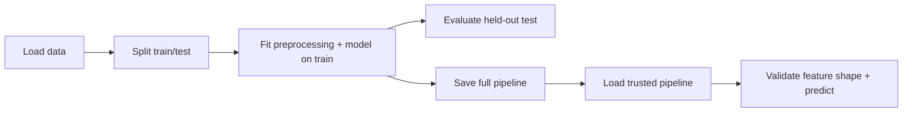

# Day 6 — Python project architecture

**Goal:** turn an ML experiment into a package that a teammate can install, test, train and use for inference.

The existing [Python fundamentals lesson](../advanced_python_fundamentals.py) introduces separation of concerns. This lesson makes that idea concrete with a small Iris classifier. The repository did not contain an existing trained ML project to restructure, so this is a new, self-contained reference project. It does not replace the earlier lesson.

## 1. Give every stage one responsibility

A notebook often mixes loading data, cleaning, training, plotting, saving and prediction in a single cell sequence. Extract reusable functions first, then keep orchestration in a thin script. You can still use notebooks for exploration; import the same package rather than copying its implementation.

```text
project_architecture/
├── pyproject.toml
├── .gitignore
├── src/
│   └── ml_architecture/
│       ├── __init__.py
│       ├── ingestion.py
│       ├── preprocessing.py
│       ├── features.py
│       ├── training.py
│       ├── evaluation.py
│       └── inference.py
├── tests/
│   └── test_pipeline.py
├── configs/
│   └── train.toml
└── scripts/
    ├── train.py
    └── predict.py
```

The extra `ml_architecture/` directory under `src/` gives the project an importable package name. Import `ml_architecture.training`, not `src.training`. Installing the package makes imports work without editing `sys.path` or relying on the current directory.

| Module | Owns | Does not own |
|---|---|---|
| `ingestion.py` | Dataset loading and basic shape checks | Model fitting |
| `preprocessing.py` | Construction of imputation/scaling steps | Fitting on the entire dataset |
| `features.py` | Feature order and input shape contract | File I/O or target labels |
| `training.py` | Estimator construction and training-only fitting | CLI arguments and output paths |
| `evaluation.py` | Metrics from a fitted model on held-out data | Fitting or tuning |
| `inference.py` | Saving/loading a trusted pipeline and predicting | Refitting preprocessing |
| `scripts/` | Wiring stages together | Duplicated ML logic |
| `configs/` | Explicit experiment settings | Secrets |
| `tests/` | Behavioral checks and regression protection | Production data |



## 2. Create an isolated virtual environment

From the repository root, enter the lesson:

```bash
cd Python/project_architecture
python -m venv .venv
```

Activate it on **Windows PowerShell**:

```powershell
.venv\Scripts\Activate.ps1
```

Or on **macOS/Linux**:

```bash
source .venv/bin/activate
```

If activation is unavailable, run the environment's Python directly (`.venv\Scripts\python.exe` on Windows or `.venv/bin/python` on macOS/Linux). Activation changes command lookup; it is not required to use the environment. Do not commit `.venv` or change system security settings just to activate it.

```bash
python -m pip install -e ".[dev]"
python -c "import ml_architecture; print(ml_architecture.__file__)"
```

`-e` installs an editable project: source edits take effect without reinstalling. `[dev]` adds the optional testing/build tools. Use `python -m pip` to target the same interpreter that runs the project.

## 3. Understand pyproject.toml and package management

Open [pyproject.toml](pyproject.toml):

- `[build-system]` selects setuptools as the build backend.
- `[project]` describes the distribution, Python requirement and runtime dependencies.
- `[project.optional-dependencies]` separates development tools from runtime libraries.
- `[tool.setuptools.packages.find]` discovers packages under `src`.
- `[tool.pytest.ini_options]` configures test discovery and imports.

The distribution name `ml-architecture-lesson` and import name `ml_architecture` have different jobs. Installing from this folder does not publish anything to PyPI.

Version ranges declare compatibility, not an exact reproducible environment. For repeatable experiments, lock the resolved transitive dependencies with your team's chosen package manager and record Python/platform versions. `pip freeze` can capture an environment snapshot, but is not a universal cross-platform lock. Keep a separate environment for each project instead of installing unrelated packages together.

Build a distributable wheel locally:

```bash
python -m build
```

The wheel goes under `dist/`. A useful release check is to install that wheel in another clean environment and import the package there. Editable-install success alone does not prove that a wheel contains the right files.

## 4. Train without leaking test data

```bash
python scripts/train.py --config configs/train.toml
```

The script loads sklearn's bundled Iris dataset (150 rows; no network download), stratifies a train/test split, fits a pipeline on the training rows, evaluates the held-out rows and writes:

```text
artifacts/model.joblib
artifacts/report.json
```

The default 20% split produces 120 training rows and 30 test rows. The report records metrics, configuration, feature order and Python/sklearn versions. Metrics are computed when you run the script; no score is promised. Artifacts are overwritten on another run with the same output directory, so choose separate output directories for experiments you want to retain.

Output paths in TOML resolve relative to the configuration file. This avoids silently sending artifacts to a different directory when a scheduler starts the script elsewhere.

**Leakage rule:** split before fitting. Imputation medians and scaling statistics are learned only from training rows. Save the entire pipeline so inference uses those same fitted transformations. Changing the model after inspecting test results repeatedly turns the test set into a tuning set; use validation/cross-validation for model selection and reserve a final test set.

## 5. Run inference with the same contract

```bash
python scripts/predict.py --model artifacts/model.joblib --features 5.1 3.5 1.4 0.2
```

Measurements must follow this order: sepal length, sepal width, petal length, petal width. Predictions are integer Iris class IDs (0=setosa, 1=versicolor, 2=virginica). Feature validation rejects empty matrices, wrong widths and infinity; NaN is handled by the fitted imputer. A same-width array with swapped columns cannot be detected automatically here—real systems should carry named schemas and schema versions.

Only load model files you created or otherwise trust. Joblib uses pickle-based deserialization and can execute code; the type annotation on `load_model` does not make an arbitrary file safe. Keep compatible dependency versions with saved artifacts.

## 6. Test behavior at the boundaries

```bash
python -m pytest -q
```

The tests check malformed feature shapes, invalid hyperparameters, training-only scaler statistics, unchanged preprocessing after evaluation, prediction consistency after save/load, missing-value handling and valid metric ranges. They use temporary directories for model artifacts.

Notice what is **not** asserted: one exact accuracy score. Dependency changes can cause small numeric differences. Tests should catch broken contracts and leakage; model-quality gates need a separately chosen dataset and acceptance policy.

## 7. Use Git and .gitignore deliberately

Because this example lives inside `ML-ops`, use the existing repository—do not initialize a second repository inside the lesson.

From the repository root, a typical learning workflow is:

```bash
git switch -c learn/python-architecture
git status --short
git diff
git add Python/project_architecture
git diff --cached
git commit -m "Add tested ML project architecture"
```

Review staged changes before committing. The lesson's `.gitignore` excludes environments, caches, build outputs, generated model artifacts and secrets. An ignore rule does not untrack previously committed files, and removing a leaked secret from a later commit does not invalidate it. Keep data/model artifacts in appropriate versioned storage and commit their metadata or references as your project grows.

## 8. Restructure your own project

1. Capture a baseline run and its data split before moving code.
2. Move data access into ingestion; pass explicit inputs to every stage.
3. Define feature order and schema; remove target-derived or future information.
4. Put learned transformations and the model in one fitted pipeline.
5. Move paths and hyperparameters into a validated configuration.
6. Add tests before changing modeling behavior; compare predictions before/after restructuring.
7. Install the package and verify it from outside its source folder.

**Exercises:** add a CSV ingestion adapter; reject a missing feature name; introduce cross-validation using training data only; add a command-line entry point under `[project.scripts]`; record a source commit and dataset checksum with each run.

This lesson demonstrates architecture, not a production deployment or a meaningful benchmark for a real business problem.

## References

- [PyPA: writing pyproject.toml](https://packaging.python.org/en/latest/guides/writing-pyproject-toml/)
- [PyPA: src layout](https://packaging.python.org/en/latest/discussions/src-layout-vs-flat-layout/)
- [scikit-learn: common pitfalls and data leakage](https://scikit-learn.org/stable/common_pitfalls.html)
- [Python virtual environments](https://docs.python.org/3/library/venv.html)
