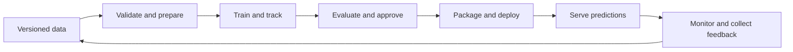

<div align="center">

# MLOps · From Experiment to Production

### Build the model. Ship the system. Keep it trustworthy.

A practical learning journey through Python, data, machine learning, deployment, and the everyday work of operating ML systems.

**Learn by building · Understand the tradeoffs · Make every run explainable**

[Start learning](#start-learning) · [Course roadmap](#course-roadmap) · [Run the examples](#run-the-examples) · [The capstone](#the-capstone)

</div>

---

## The story starts with a model that works

You train a model. The score looks promising. The notebook runs.

Then someone asks: **“Can we use this tomorrow?”**

That question changes the work. Tomorrow's data may look different. A teammate needs to reproduce your results. An API needs to respond on time. A failed deployment needs a way back. And when predictions get worse, someone needs to notice—and understand why.

This course follows that journey. We start with the Python skills that make code understandable, then build toward reproducible experiments, automated pipelines, deployed services, and feedback loops that help a system improve.

Each stage answers a practical question:

> Can we reproduce it? Can we test it? Can we ship it safely? Can we tell when it stops working?

## What we are building toward

The destination is an ML system whose behavior we can explain from input data to production prediction.



Along the way, we will learn to connect model quality with software quality, operational reliability, security, and cost. A higher offline score is one part of the decision to release a model.

## Start learning

**Current status: the Python foundation lesson is available. The broader MLOps curriculum below is the planned course direction; later modules and the capstone have not been implemented yet.** Tools and lesson boundaries may evolve as the course grows.

Start with [Advanced Python Fundamentals](Python/advanced_python_fundamentals.py). It combines explanations and executable examples in one file.

| Available lesson area | What you will practice |
| --- | --- |
| Python building blocks | Comprehensions, generators, iterators, decorators, closures, context managers, argument unpacking, collections, itertools, and functools |
| Object-oriented design | Classes, dataclasses, inheritance, abstract classes, properties, class and static methods, protocols, composition, and dependency injection |
| Types and application boundaries | Optional, Union, Literal, TypedDict, generics, validation, clean functions, separation of concerns, DRY, and SOLID basics |
| API foundations | Pydantic request and response models, a small FastAPI prediction service, and dependency injection |
| Logging and failures | DEBUG through CRITICAL, structured JSON events, contextual fields, custom exceptions, and exception chaining |
| Configuration and secrets | Environment variables, explicit `.env` loading, JSON, YAML, configuration validation, secret files, and Pydantic settings |

The prediction example uses a simple mean of probability features to keep the engineering ideas visible. It is a teaching example, not a trained model or a complete production service.

## Course roadmap

**Available foundation** means an introduction exists in the current Python lesson. **Planned** means the dedicated course material is still to come.

| Stage | The question | Topics we will cover | Practical outcome | Status |
| --- | --- | --- | --- | --- |
| 01 · Python for ML systems | Can someone else understand and extend this code? | Advanced Python, typing, OOP, interfaces, clean design, exceptions, logging, configuration, and secrets | A readable, configurable prediction application | Available foundation |
| 02 · Engineering workflow | Can a teammate run and change it confidently? | Git, project structure, virtual environments, dependency locking, packaging, unit and integration tests, linting, and type checks | A reproducible project with automated checks | Planned |
| 03 · Data foundations | Can we trust the inputs? | SQL, ingestion, schemas, data quality, missing values, leakage, train/validation/test splits, and data versioning | A validated dataset with traceable origins | Planned |
| 04 · Reproducible modeling | Can we explain why this model won? | Baselines, preprocessing, feature engineering, metrics, cross-validation, tuning, random seeds, and error analysis | A repeatable training and evaluation workflow | Planned |
| 05 · Experiment and model management | Which run produced this artifact? | Experiment tracking, parameters, metrics, artifacts, lineage, model registries, and promotion criteria | A traceable candidate ready for review | Planned |
| 06 · Automated pipelines | Can the workflow recover from failure? | Pipeline stages, orchestration, scheduling, retries, idempotency, caching, and training/serving consistency | A repeatable data-to-model pipeline | Planned |
| 07 · Serving and contracts | How will people use predictions? | Batch and online inference, FastAPI, request validation, model loading, API versioning, concurrency, and performance tests | A tested inference service and batch workflow | Available API foundation; full module planned |
| 08 · Containers and infrastructure | Can we run it consistently elsewhere? | Docker, image builds, cloud fundamentals, networking, storage, infrastructure as code, and an introduction to Kubernetes | A portable service with documented infrastructure | Planned |
| 09 · Delivery and release | How do we change the system safely? | CI/CD, automated evaluation gates, artifact promotion, deployment strategies, health checks, and rollback | A controlled path from change to release | Planned |
| 10 · Observability and operations | How will we know something is wrong? | Logs, metrics, traces, latency, errors, service objectives, alerts, dashboards, and incident response | A service with measurable health and a runbook | Available logging foundation; full module planned |
| 11 · ML lifecycle and governance | What happens as the world changes? | Data and prediction drift, delayed labels, performance monitoring, retraining triggers, approval, fairness, privacy, access control, and auditability | A monitored feedback loop with accountable decisions | Planned |
| 12 · Capstone and tradeoffs | Can we operate the whole system? | End-to-end integration, load and failure exercises, cost, documentation, and architecture review | A demonstrable ML system with a release and recovery story | Planned |

We will choose tools to support each lesson's learning goal. The roadmap describes the capabilities we intend to build; it does not imply that a particular cloud platform or toolchain is already configured.

## Run the examples

You need **Python 3.10+** and Git. Start from a terminal:

```bash
git clone https://github.com/JCZY999/ML-ops.git
cd ML-ops
python -m venv .venv
```

Activate the environment using the command for your shell:

| Shell | Command |
| --- | --- |
| macOS / Linux (bash or zsh) | `source .venv/bin/activate` |
| Windows PowerShell | `.\.venv\Scripts\Activate.ps1` |
| Windows Command Prompt | `.venv\Scripts\activate.bat` |

### 1. Run the core Python lesson

The core examples use only the standard library:

```bash
python Python/advanced_python_fundamentals.py
```

Read the comments alongside the output. Follow the model configuration through the model, service, and prediction sink to see how the pieces fit together.

### 2. Explore logging and configuration

```bash
python -m pip install "pydantic-settings>=2,<3" "PyYAML>=6,<7"
python Python/advanced_python_fundamentals.py --operations
```

This runs the core lesson and then the operations demo. The demo creates temporary JSON, YAML, dotenv, and fake secret files, validates settings, and emits structured log events. It intentionally demonstrates a missing configuration file and catches that failure; an error event in this example is expected.

Existing `STUDY_*` environment variables can override the demo's file values. Configuration priority in this lesson is:

```text
Constructor overrides > environment > .env > secret files > JSON/YAML > defaults
```

Use fake credentials while learning. Keep real `.env` files and secret directories out of Git, and never print credentials in logs. `SecretStr` masks ordinary representations; it does not encrypt a secret.

### 3. Explore validation and the prediction API

```bash
python -m pip install "pydantic>=2,<3" "fastapi>=0.115,<1" uvicorn
python Python/advanced_python_fundamentals.py --pydantic
cd Python
python -m uvicorn advanced_python_fundamentals:create_app --factory
```

Open [the local API documentation](http://127.0.0.1:8000/docs), select `POST /predict`, and try:

```json
{
  "features": [0.8, 0.9],
  "request_id": "first-prediction"
}
```

Expect a score of approximately `0.85` and a positive label with the default threshold. Then try an empty feature list or a value outside `[0, 1]` and inspect the validation response.

Stop the server with **Ctrl+C**. The API is a local educational example with an in-memory sink; production authentication, durable storage, and deployment operations are future work.

## How to use this course

1. **Read for intent.** Identify the problem each example solves before focusing on syntax.
2. **Run the example.** Connect the explanation to actual output.
3. **Change one assumption.** Try an invalid value, another threshold, or a failing dependency.
4. **Explain the result.** Describe what happened and which part of the system owns that behavior.
5. **Carry the idea forward.** Reuse the pattern as the course grows into a complete application.

Basic Python familiarity is helpful. You do not need a cloud account for the current lessons.

## The capstone

The planned capstone brings the course together around a prediction service. We will take a dataset through validation, training, evaluation, packaging, deployment, and monitoring.

The final demonstration should answer concrete questions:

- Which data, code, configuration, and experiment produced the deployed model?
- What evidence justified releasing it?
- What happens when input data is invalid or a dependency fails?
- How do we detect service degradation and changes in model performance?
- How do we roll back, investigate, and decide whether to retrain?
- What does the system cost, and which tradeoffs would change at a larger scale?

The intended deliverables are a reproducible training workflow, tracked artifacts, a tested API, a container image, a delivery pipeline, monitoring, and an operational runbook. These are roadmap targets, not existing repository features.

## Repository map

```text
ML-ops/
├── README.md
└── Python/
    └── advanced_python_fundamentals.py
```

New course modules will be linked here as they become available.

## Learning together

Found an unclear explanation or an example that fails? [Open an issue](https://github.com/JCZY999/ML-ops/issues) with the lesson, your Python version, what you expected, and what happened. Remove credentials and private data from any output you share.

Suggestions for future lessons are welcome. The aim is to understand the decisions behind an ML system well enough to build, explain, and improve one.

---

<div align="center">

**A model makes a prediction. A well-engineered system makes that prediction useful.**

</div>
